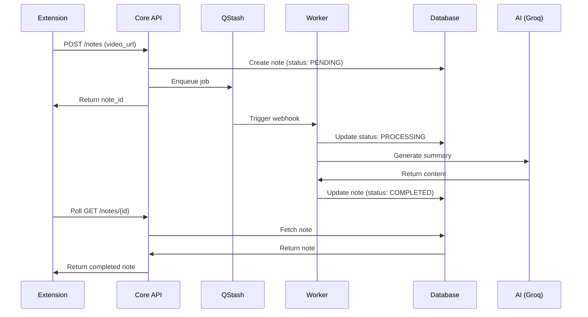
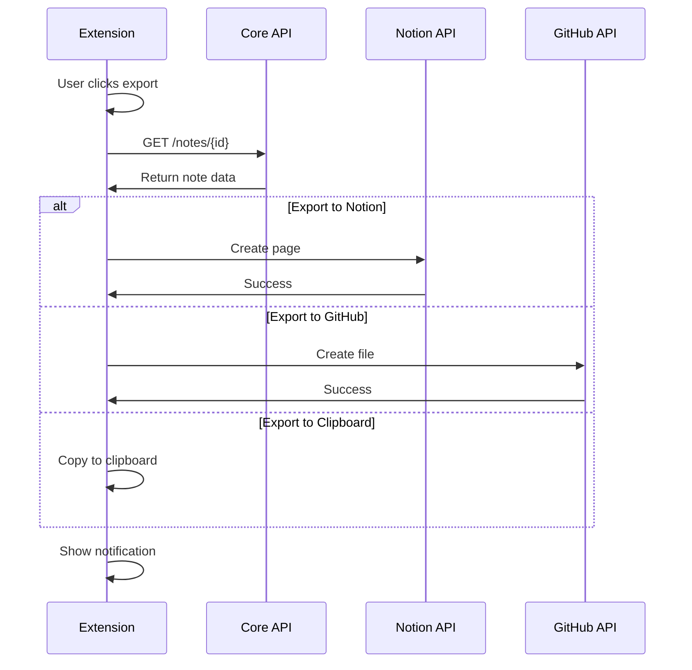
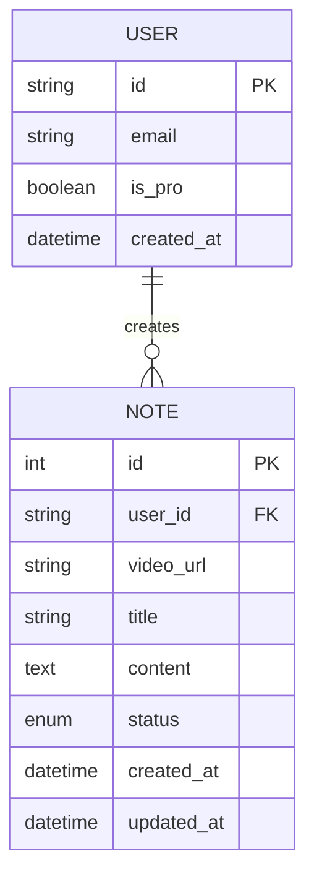

# TubeWiki Architecture Structure

**最適化されたアーキテクチャ設計**

Clean Architecture + Microservices

---

## 📊 現在の構造分析

### プロジェクト構成

```
TubeWiki/
├── extension/          # Chrome拡張機能 (Frontend)
├── core/              # Core API Service (Backend)
├── worker/            # Worker Service (Background Jobs)
├── shared/            # 共有モデル・ユーティリティ
├── tests/             # テストコード
├── scripts/           # ユーティリティスクリプト
└── docs/              # ドキュメント
```

### 評価

✅ **良い点:**
- マイクロサービス的な分離
- 共有コードの一元管理
- 明確な責務分離

⚠️ **改善点:**
- 依存関係の明確化
- レイヤー構造の最適化
- エラーハンドリングの統一

---

## 🎯 最適化されたアーキテクチャ

### レイヤー構造

```
┌─────────────────────────────────────┐
│     Presentation Layer              │
│  (Chrome Extension - React/TS)      │
└──────────────┬──────────────────────┘
               │ HTTP/REST
┌──────────────▼──────────────────────┐
│     API Gateway Layer               │
│  (Core Service - FastAPI)           │
│  - Authentication                   │
│  - Rate Limiting                    │
│  - Request Validation               │
└──────────────┬──────────────────────┘
               │
    ┌──────────┴──────────┐
    │                     │
┌───▼────────┐    ┌──────▼──────────┐
│  Business  │    │  Background     │
│  Logic     │    │  Processing     │
│  (Core)    │    │  (Worker)       │
└───┬────────┘    └──────┬──────────┘
    │                    │
    └──────────┬─────────┘
               │
┌──────────────▼──────────────────────┐
│     Data Access Layer               │
│  (Shared Models + SQLModel)         │
└──────────────┬──────────────────────┘
               │
┌──────────────▼──────────────────────┐
│     Infrastructure Layer            │
│  - Supabase (PostgreSQL)            │
│  - Upstash QStash                   │
│  - Groq API                         │
│  - Notion API                       │
└─────────────────────────────────────┘
```

---

## 📁 最適化されたディレクトリ構造

### Extension (Frontend)

```
extension/
├── public/
│   └── icons/              # アイコン
├── src/
│   ├── background/         # Service Worker
│   │   └── index.ts
│   ├── content/            # Content Scripts
│   │   ├── index.tsx       # エントリーポイント
│   │   ├── ExportBar.tsx   # メインコンポーネント
│   │   ├── style.css       # スタイル
│   │   └── exporters/      # エクスポート機能
│   │       ├── clipboard.ts
│   │       ├── download.ts
│   │       ├── notion.ts
│   │       ├── github.ts
│   │       └── obsidian.ts
│   ├── popup/              # ポップアップUI
│   │   ├── index.html
│   │   ├── Popup.tsx
│   │   └── Settings.tsx    # 設定画面
│   ├── components/         # 共有コンポーネント
│   │   ├── Login.tsx
│   │   ├── Button.tsx
│   │   └── Spinner.tsx
│   ├── lib/                # ライブラリ
│   │   ├── api.ts          # API クライアント
│   │   ├── supabase.ts     # Supabase クライアント
│   │   └── storage.ts      # Chrome Storage
│   ├── types/              # 型定義
│   │   ├── note.ts
│   │   └── user.ts
│   └── utils/              # ユーティリティ
│       └── format.ts
├── manifest.json
├── vite.config.ts
└── package.json
```

---

### Core Service (Backend API)

```
core/
├── api/                    # API エンドポイント
│   ├── __init__.py
│   ├── notes.py           # ノート管理
│   ├── payment.py         # 決済
│   └── health.py          # ヘルスチェック
├── services/              # ビジネスロジック
│   ├── __init__.py
│   ├── auth.py           # 認証サービス
│   ├── qstash.py         # QStash連携
│   └── stripe_service.py # Stripe連携
├── middleware/            # ミドルウェア
│   ├── __init__.py
│   ├── auth.py           # 認証ミドルウェア
│   ├── error_handler.py  # エラーハンドリング
│   └── rate_limit.py     # レート制限
├── config.py             # 設定
├── main.py               # エントリーポイント
└── .env                  # 環境変数
```

---

### Worker Service (Background Jobs)

```
worker/
├── api/                   # Webhook エンドポイント
│   ├── __init__.py
│   └── webhook.py        # QStash Webhook
├── services/             # 処理サービス
│   ├── __init__.py
│   ├── youtube.py        # YouTube処理
│   ├── ai.py            # AI生成
│   ├── notion.py        # Notion連携
│   └── security.py      # セキュリティ
├── jobs/                 # ジョブ定義
│   ├── __init__.py
│   └── process_video.py # 動画処理ジョブ
├── config.py            # 設定
├── main.py              # エントリーポイント
├── Dockerfile           # Docker設定
└── .env                 # 環境変数
```

---

### Shared (共有コード)

```
shared/
├── models/               # データモデル
│   ├── __init__.py
│   ├── user.py
│   ├── note.py
│   └── base.py
├── schemas/             # Pydanticスキーマ
│   ├── __init__.py
│   ├── note.py
│   └── user.py
├── utils/               # ユーティリティ
│   ├── __init__.py
│   ├── logger.py       # ロギング
│   ├── validators.py   # バリデーション
│   └── exceptions.py   # カスタム例外
├── db.py               # データベース接続
└── db_init.py          # DB初期化
```

---

## 🔄 データフロー

### 1. ノート作成フロー



---

### 2. エクスポートフロー



---

## 🏛️ Clean Architecture原則

### 依存関係ルール

```
外側 → 内側への依存のみ許可

┌─────────────────────────────────┐
│  Infrastructure Layer           │  ← 外部サービス
│  (Supabase, Groq, QStash)      │
└────────────┬────────────────────┘
             │
┌────────────▼────────────────────┐
│  Interface Adapters             │  ← API, Controllers
│  (FastAPI Routes, Schemas)     │
└────────────┬────────────────────┘
             │
┌────────────▼────────────────────┐
│  Application Business Rules     │  ← Services
│  (Use Cases, Services)          │
└────────────┬────────────────────┘
             │
┌────────────▼────────────────────┘
│  Enterprise Business Rules      │  ← Models
│  (Domain Models, Entities)      │
└─────────────────────────────────┘
```

---

## 🔐 セキュリティレイヤー

### 認証・認可フロー

```
┌─────────────────────────────────┐
│  Extension                      │
│  - Supabase Auth Session        │
└──────────────┬──────────────────┘
               │ JWT Token
┌──────────────▼──────────────────┐
│  Core API                       │
│  - JWT Verification             │
│  - User ID Extraction           │
└──────────────┬──────────────────┘
               │
┌──────────────▼──────────────────┐
│  Worker Service                 │
│  - QStash Signature Verify      │
│  - Request Validation           │
└─────────────────────────────────┘
```

### セキュリティチェックリスト

- ✅ JWT署名検証
- ✅ QStash署名検証
- ✅ CORS設定
- ✅ Rate Limiting
- ✅ Input Validation
- ✅ SQL Injection防止 (SQLModel)
- ✅ XSS防止 (Content Security Policy)

---

## 📊 データベース設計

### ER図



### インデックス戦略

```sql
-- ユーザーIDでの検索を高速化
CREATE INDEX idx_notes_user_id ON notes(user_id);

-- URLでの検索を高速化
CREATE INDEX idx_notes_video_url ON notes(video_url);

-- ステータスでのフィルタリング
CREATE INDEX idx_notes_status ON notes(status);

-- 複合インデックス（ユーザー + ステータス）
CREATE INDEX idx_notes_user_status ON notes(user_id, status);
```

---

## 🚀 デプロイメント戦略

### 環境構成

```
┌─────────────────────────────────┐
│  Production                     │
│  - Core: Railway                │
│  - Worker: Railway              │
│  - DB: Supabase                 │
│  - Extension: Chrome Web Store  │
└─────────────────────────────────┘

┌─────────────────────────────────┐
│  Staging                        │
│  - Core: Railway (staging)      │
│  - Worker: Railway (staging)    │
│  - DB: Supabase (staging)       │
│  - Extension: Local build       │
└─────────────────────────────────┘

┌─────────────────────────────────┐
│  Development                    │
│  - Core: localhost:8000         │
│  - Worker: localhost:8001       │
│  - DB: Supabase (dev)           │
│  - Extension: Local build       │
└─────────────────────────────────┘
```

---

### CI/CD パイプライン

```yaml
# .github/workflows/deploy.yml
name: Deploy

on:
  push:
    branches: [main]

jobs:
  test:
    runs-on: ubuntu-latest
    steps:
      - uses: actions/checkout@v2
      - name: Run tests
        run: pytest

  deploy-core:
    needs: test
    runs-on: ubuntu-latest
    steps:
      - name: Deploy to Railway
        run: railway up --service core

  deploy-worker:
    needs: test
    runs-on: ubuntu-latest
    steps:
      - name: Deploy to Railway
        run: railway up --service worker

  build-extension:
    needs: test
    runs-on: ubuntu-latest
    steps:
      - name: Build extension
        run: cd extension && npm run build
      - name: Upload artifact
        uses: actions/upload-artifact@v2
```

---

## 🔧 環境変数管理

### Core Service

```bash
# Database
DATABASE_URL=postgresql://...

# Authentication
SUPABASE_JWT_SECRET=xxx

# External Services
QSTASH_URL=https://qstash.upstash.io/v1/publish
QSTASH_TOKEN=xxx
WORKER_URL=https://worker.railway.app

# Payment
STRIPE_SECRET_KEY=sk_xxx
STRIPE_PRICE_ID=price_xxx
STRIPE_WEBHOOK_SECRET=whsec_xxx
```

### Worker Service

```bash
# Database
DATABASE_URL=postgresql://...

# AI
GROQ_API_KEY=gsk_xxx

# Notion
NOTION_TOKEN=secret_xxx

# Security
QSTASH_CURRENT_SIGNING_KEY=xxx
QSTASH_NEXT_SIGNING_KEY=xxx
```

---

### Extension

```bash
# Supabase
VITE_SUPABASE_URL=https://xxx.supabase.co
VITE_SUPABASE_ANON_KEY=eyJ...

# API
VITE_API_URL=https://core.railway.app
```

---

## 📈 スケーラビリティ戦略

### 水平スケーリング

```
┌─────────────────────────────────┐
│  Load Balancer                  │
└──────────┬──────────────────────┘
           │
    ┌──────┴──────┐
    │             │
┌───▼────┐   ┌───▼────┐
│ Core 1 │   │ Core 2 │  ← 複数インスタンス
└───┬────┘   └───┬────┘
    │             │
    └──────┬──────┘
           │
┌──────────▼──────────────────────┐
│  Database (Supabase)            │
│  - Connection Pooling           │
│  - Read Replicas                │
└─────────────────────────────────┘
```

### キャッシング戦略

```
┌─────────────────────────────────┐
│  Extension                      │
│  - LocalStorage (セッション)    │
└──────────┬──────────────────────┘
           │
┌──────────▼──────────────────────┐
│  Core API                       │
│  - Redis (将来的に)             │
└──────────┬──────────────────────┘
           │
┌──────────▼──────────────────────┐
│  Database                       │
└─────────────────────────────────┘
```

---

## 🧪 テスト戦略

### テストピラミッド

```
        ┌─────────┐
        │   E2E   │  ← 少数（重要フロー）
        └─────────┘
      ┌─────────────┐
      │ Integration │  ← 中程度（API）
      └─────────────┘
    ┌─────────────────┐
    │   Unit Tests    │  ← 多数（ビジネスロジック）
    └─────────────────┘
```

### テストカバレッジ目標

- **Unit Tests**: 80%以上
- **Integration Tests**: 主要API全て
- **E2E Tests**: クリティカルパス

---

## 📊 モニタリング・ロギング

### ログレベル

```python
# shared/utils/logger.py
import logging

logger = logging.getLogger(__name__)

# Development
logger.setLevel(logging.DEBUG)

# Production
logger.setLevel(logging.INFO)

# ログフォーマット
formatter = logging.Formatter(
    '%(asctime)s - %(name)s - %(levelname)s - %(message)s'
)
```

### メトリクス

```
- API Response Time
- Error Rate
- Active Users
- Note Generation Success Rate
- QStash Queue Length
- Database Connection Pool
```

---

## 🔄 マイグレーション戦略

### データベースマイグレーション

```bash
# Alembicを使用
alembic init alembic
alembic revision --autogenerate -m "Add new column"
alembic upgrade head
```

### バージョニング

```
API Version: v1
Extension Version: 1.0.0
Database Schema Version: 001
```

---

## 🎯 パフォーマンス最適化

### Core API

- ✅ 非同期処理 (FastAPI async)
- ✅ データベース接続プーリング
- ✅ バッチ処理
- ✅ ページネーション

### Worker Service

- ✅ 並列処理 (asyncio)
- ✅ タイムアウト設定
- ✅ リトライメカニズム
- ✅ エラーハンドリング

### Extension

- ✅ コード分割 (Vite)
- ✅ 遅延ローディング
- ✅ Shadow DOM (スタイル隔離)
- ✅ メモリリーク防止

---

## 📝 コーディング規約

### Python (Core & Worker)

```python
# PEP 8準拠
# Type hints必須
def create_note(user_id: str, video_url: str) -> Note:
    """Create a new note.
    
    Args:
        user_id: User ID
        video_url: YouTube video URL
        
    Returns:
        Created note object
        
    Raises:
        ValueError: If video_url is invalid
    """
    pass

# Async/Await
async def fetch_data() -> dict:
    async with httpx.AsyncClient() as client:
        response = await client.get(url)
        return response.json()
```

---

### TypeScript (Extension)

```typescript
// 型定義必須
interface Note {
  id: number
  title: string | null
  content: string | null
}

// 関数型プログラミング
const processNote = (note: Note): string => {
  return note.title ?? 'Untitled'
}

// Async/Await
const fetchNote = async (id: number): Promise<Note> => {
  const response = await fetch(`/api/notes/${id}`)
  return response.json()
}

// エラーハンドリング
try {
  await fetchNote(1)
} catch (error) {
  console.error('Failed to fetch note:', error)
}
```

---

## 🔒 セキュリティベストプラクティス

### 1. 認証

```python
# Core API
from fastapi import Depends, HTTPException
from jose import jwt

async def get_current_user(token: str = Depends(oauth2_scheme)):
    try:
        payload = jwt.decode(token, SECRET_KEY)
        user_id = payload.get("sub")
        if user_id is None:
            raise HTTPException(status_code=401)
        return user_id
    except jwt.JWTError:
        raise HTTPException(status_code=401)
```

### 2. 入力検証

```python
from pydantic import BaseModel, validator

class NoteCreate(BaseModel):
    video_url: str
    
    @validator('video_url')
    def validate_youtube_url(cls, v):
        if 'youtube.com' not in v:
            raise ValueError('Invalid YouTube URL')
        return v
```

---

### 3. Rate Limiting

```python
from slowapi import Limiter
from slowapi.util import get_remote_address

limiter = Limiter(key_func=get_remote_address)

@app.post("/notes")
@limiter.limit("10/minute")
async def create_note():
    pass
```

### 4. CORS設定

```python
from fastapi.middleware.cors import CORSMiddleware

app.add_middleware(
    CORSMiddleware,
    allow_origins=["chrome-extension://*"],
    allow_credentials=True,
    allow_methods=["*"],
    allow_headers=["*"],
)
```

---

## 📚 ドキュメント構造

```
docs/
├── architecture/
│   ├── overview.md
│   ├── data-flow.md
│   └── security.md
├── api/
│   ├── core-api.md
│   └── worker-api.md
├── development/
│   ├── setup.md
│   ├── testing.md
│   └── deployment.md
├── user-guides/
│   ├── installation.md
│   └── usage.md
└── troubleshooting/
    ├── common-issues.md
    └── faq.md
```

---

## 🎯 実装優先順位

### Phase 1: 基盤強化 (完了)
- ✅ Export Bar実装
- ✅ Clipboard/Download export
- ✅ 型定義の統一

### Phase 2: 外部連携 (次)
- [ ] Notion export
- [ ] GitHub export
- [ ] Obsidian export
- [ ] 設定画面

### Phase 3: 品質向上
- [ ] エラーハンドリング強化
- [ ] テストカバレッジ向上
- [ ] パフォーマンス最適化

### Phase 4: スケーリング
- [ ] Redis導入
- [ ] ロードバランシング
- [ ] モニタリング強化

---

## 📊 成功指標

### 技術指標
- API Response Time < 200ms
- Error Rate < 1%
- Test Coverage > 80%
- Build Time < 2min

### ビジネス指標
- User Retention > 40%
- Note Generation Success Rate > 95%
- Export Success Rate > 99%

---

## 🚀 次のステップ

### 即座に実装可能

1. **エラーハンドリング統一**
   ```python
   # shared/utils/exceptions.py
   class TubeWikiException(Exception):
       pass
   
   class NoteNotFoundError(TubeWikiException):
       pass
   ```

2. **ロギング強化**
   ```python
   # shared/utils/logger.py
   import structlog
   
   logger = structlog.get_logger()
   ```

3. **設定管理統一**
   ```python
   # shared/config.py
   from pydantic import BaseSettings
   
   class Settings(BaseSettings):
       database_url: str
       class Config:
           env_file = ".env"
   ```

---

## 📌 まとめ

### アーキテクチャの原則

1. **Single Responsibility**: 各サービスは単一の責務
2. **Dependency Inversion**: 抽象に依存、具象に依存しない
3. **Open/Closed**: 拡張に開き、修正に閉じる
4. **Interface Segregation**: 必要なインターフェースのみ
5. **DRY**: コードの重複を避ける

### 設計パターン

- **Repository Pattern**: データアクセス抽象化
- **Service Pattern**: ビジネスロジック分離
- **Factory Pattern**: オブジェクト生成
- **Strategy Pattern**: アルゴリズム切り替え

### 次の改善

- Middleware層の強化
- Caching戦略の実装
- モニタリングダッシュボード
- 自動スケーリング

---

## 🎉 結論

このアーキテクチャは：

✅ **スケーラブル**: 水平スケーリング可能
✅ **保守性**: Clean Architecture原則
✅ **セキュア**: 多層防御
✅ **テスタブル**: 依存性注入
✅ **拡張可能**: プラグイン可能

**TubeWikiは成長に対応できる堅牢な基盤を持っています！**
