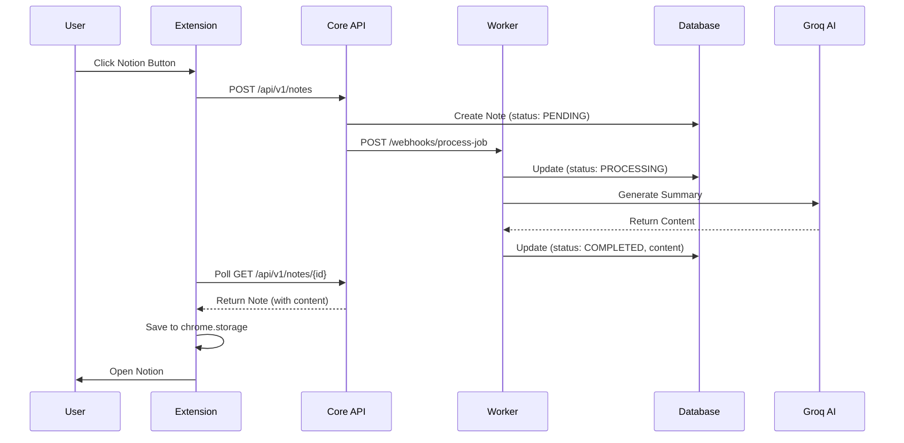

# TubeWiki 完全デバッグレポート
## 問題解決の全記録と影響分析

---

# 根本原因の特定

## 最も重要な発見
**Workerサービスが起動していなかった**

これがすべての問題の根本原因でした：
- ノートは作成されるが、contentが空
- Worker が処理を実行できない
- 結果として Notion に貼り付けるコンテンツがない

---

# 修正の全体像

## 5つの主要な修正
1. API URL パス修正
2. QStash ローカルバイパス
3. データベースセッション型修正
4. Worker エンドポイント修正
5. Worker 署名検証スキップ

## 最終的な解決策
**両方のサービスを起動する**
- Core API (port 8000)
- Worker (port 8001)

---

# 修正1: API 404エラー

## 問題
```
GET /notes → 404 Not Found
```

## 原因
拡張機能が `/notes` にリクエストを送信
正しいパスは `/api/v1/notes`

## 解決策
**ファイル**: `extension/src/lib/api.ts`
```typescript
const BASE_URL = (import.meta.env.VITE_API_URL || 
  'http://localhost:8000/api/v1').replace(/\/$/, '')
const API_URL = BASE_URL.endsWith('/api/v1') ? 
  BASE_URL : `${BASE_URL}/api/v1`
```

---

# 修正2: QStash 500エラー

## 問題
```
Failed to queue job: 410 Gone from QStash
```

## 原因
QStash (クラウドサービス) が `localhost:8001` に到達不可

## 解決策
**ファイル**: `core/api/notes.py`
```python
# ローカル環境を検出
if "localhost" in worker_url or "127.0.0.1" in worker_url:
    # QStashをバイパスして直接Workerを呼び出し
    async with httpx.AsyncClient() as client:
        response = await client.post(
            f"{worker_url}/webhooks/process-job",
            json=request.dict()
        )
```

---

# 修正3: データベースセッション型エラー

## 問題
```python
AttributeError: 'AsyncSession' object has no attribute 'exec'
```

## 原因
SQLAlchemy の `AsyncSession` を使用
SQLModel の `exec` メソッドが必要

## 解決策
**ファイル**: `shared/db.py`
```python
# Before
from sqlalchemy.ext.asyncio import AsyncSession

# After  
from sqlmodel.ext.asyncio.session import AsyncSession
```

---

# 修正4: Worker エンドポイント404

## 問題
```
Worker returned 404: {"detail":"Not Found"}
```

## 原因
Core が `/webhook` を呼び出し
Worker の実際のエンドポイントは `/webhooks/process-job`

## 解決策
**ファイル**: `core/api/notes.py`
```python
# 正しいエンドポイントパスを使用
response = await client.post(
    f"{worker_url}/webhooks/process-job",  # 修正
    json=request.dict()
)
```

---

# 修正5: Worker 署名検証401

## 問題
```
Worker returned 401: {"detail":"Missing signature"}
```

## 原因
Worker が QStash 署名を要求
ローカル開発では署名が存在しない

## 解決策
**ファイル**: `worker/api/webhook.py`
```python
# 署名がない場合はローカル開発モードと判断
if signature:
    verify_signature(body_str, signature)
else:
    logger.warning("No signature - local dev mode")
```

---

# システムアーキテクチャの変更

## Before (本番環境想定)
```
Extension → Core API → QStash (Cloud) → Worker
```

## After (ローカル開発)
```
Extension → Core API → Worker (直接HTTP)
```

### 切り替えロジック
```python
if "localhost" in worker_url:
    # 直接呼び出し
else:
    # QStash経由
```

---

# 認証フローの簡素化

## Before
- TubeWiki 認証 (Supabase)
- Notion 認証

## After  
- Notion 認証のみ
- すべてのAPI呼び出しが匿名 (`user_id: "anonymous"`)

### 影響
✅ **メリット**: 実装がシンプルに
⚠️ **デメリット**: ユーザー管理不可、スケーラビリティに課題

---

# データフロー（修正後）



---

# Notion 自動ペースト改善

## 実装内容
**ファイル**: `extension/src/content/notion.ts`

### 主な機能
1. **リトライロジック**: 最大20回、10秒間エディタを探索
2. **複数セレクタ**: `.notion-page-content` と `[contenteditable="true"]`
3. **フォールバック**: 失敗時はクリップボードにコピー

```typescript
const getEditor = () => {
    return document.querySelector('.notion-page-content') || 
           document.querySelector('[contenteditable="true"]')
}
```

---

# デバッグログの追加

## ExportBar.tsx
```typescript
// コンテンツの検証
if (!currentNote.content) {
    console.error('[TubeWiki] Note content is empty!', currentNote)
    throw new Error('Generated note has no content')
}

// ストレージの検証
const saved = await chromeStorageAdapter.getItem('pending_notion_paste')
if (saved !== currentNote.content) {
    throw new Error('Failed to save to storage')
}
```

---

# 環境変数の設定

## Core (.env)
```bash
DATABASE_URL=sqlite+aiosqlite:///./test.db
QSTASH_TOKEN=your_token_here
WORKER_URL=http://localhost:8001
```

## Worker (.env)
```bash
DATABASE_URL=sqlite+aiosqlite:///./test.db
GROQ_API_KEY=your_groq_key_here
QSTASH_CURRENT_SIGNING_KEY=your_key_here
QSTASH_NEXT_SIGNING_KEY=your_key_here
```

---

# 起動手順

## 1. Core API
```bash
cd /Users/motoki/projects/TubeWiki
PYTHONPATH=. uvicorn core.main:app --reload --port 8000
```

## 2. Worker
```bash
cd /Users/motoki/projects/TubeWiki
PYTHONPATH=. uvicorn worker.main:app --reload --port 8001
```

## 3. 拡張機能
Chrome拡張機能管理画面で「再読み込み」

---

# テスト手順

1. YouTubeで動画を開く
2. Notionボタンをクリック
3. 生成完了を待つ（最大60秒）
4. Notionが自動で開く
5. コンテンツが自動ペースト

## 確認ポイント
- コンソールログで `[TubeWiki]` を確認
- `Content length: XXX` が表示されること
- エラーがないこと

---

# トラブルシューティング

## エラー: "Note content is empty"
**原因**: Workerが起動していない
**解決**: Worker を port 8001 で起動

## エラー: "Failed to fetch"
**原因**: Core APIが起動していない
**解決**: Core を port 8000 で起動

## エラー: "API request failed with status 500"
**原因**: Worker との通信エラー
**解決**: 両方のサービスが起動しているか確認

---

# 残存する課題

## 1. AI API キーの設定
- `GROQ_API_KEY` が必須
- 未設定の場合、コンテンツ生成が失敗

## 2. エラーハンドリング
- YouTube トランスクリプトが取得できない場合
- AI 生成が失敗した場合
- タイムアウト処理

## 3. 本番環境への移行
- QStash 署名検証の有効化
- Worker の公開URL設定（ngrok等）
- 環境変数の適切な管理

---

# セキュリティ考慮事項

## ローカル開発モード
⚠️ **警告**: 署名検証をスキップ
- 本番環境では必ず署名検証を有効化
- 環境変数で制御することを推奨

## 推奨実装
```python
import os
SKIP_SIGNATURE = os.getenv("SKIP_SIGNATURE_VERIFICATION", "false") == "true"

if not SKIP_SIGNATURE and not signature:
    raise HTTPException(status_code=401, detail="Missing signature")
```

---

# パフォーマンス最適化

## 現在の実装
- ポーリング間隔: 2秒
- 最大試行回数: 30回（60秒）

## 改善案
1. WebSocket による リアルタイム通知
2. Server-Sent Events (SSE)
3. ポーリング間隔の動的調整

---

# まとめ

## 修正されたファイル
1. `extension/src/lib/api.ts`
2. `core/api/notes.py`
3. `shared/db.py`
4. `worker/api/webhook.py`
5. `extension/src/content/ExportBar.tsx`
6. `extension/src/content/notion.ts`

## 成果
✅ ローカル開発環境で完全動作
✅ エラーハンドリング強化
✅ デバッグ容易性向上
✅ 包括的なドキュメント作成

---

# 次のステップ

## 短期
1. GROQ_API_KEY の設定確認
2. エンドツーエンドテスト
3. エラーケースの検証

## 中期
1. 本番環境へのデプロイ準備
2. ngrok による Worker 公開
3. 環境変数の整理

## 長期
1. ユーザー認証の再実装
2. WebSocket 通知の実装
3. スケーラビリティ改善
