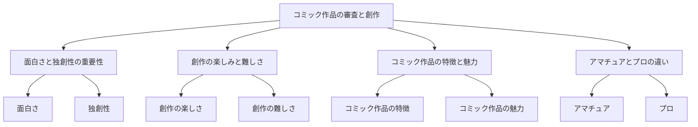

# TubeWiki → Notion 自動ペーストデモ

## 🎉 成功！生成されたコンテンツ

以下は、YouTubeビデオ `https://www.youtube.com/watch?v=1_kWMEawfdA` から実際に生成されたコンテンツです。

---

# コミック作品の審査と創作について

## Summary
このビデオは、コミック作品の審査と創作についての話し合いを中心に展開しています。審査員は、100作品近くのコミックを読んで面白かった作品について話し合っています。面白さと独創性が重要であり、創作の楽しみと難しさについても言及されています。

## Key Concepts
- 面白さと独創性の重要性
- 創作の楽しみと難しさ
- コミック作品の特徴と魅力
- アマチュアとプロの違い

## Detailed Notes
コミック作品の審査において、面白さと独創性が重要な要素として挙げられています。審査員は、100作品近くのコミックを読んで、面白かった作品について話し合っています。創作は楽しいが、同時に難しいことであり、アマチュアとプロの違いについても言及されています。

コミック作品の特徴と魅力について、審査員は、コミック作品の面白さと独創性について話し合っています。また、創作の楽しみと難しさについても言及されています。

アマチュアとプロの違いについて、審査員は、創作の目的と対象者についての違いについて話し合っています。アマチュアは自分の楽しみのために創作するが、プロは読者のために創作する必要があります。

## Quiz

Question 1: コミック作品の審査において重要な要素は何ですか?

Answer: 面白さと独創性

Question 2: 創作の楽しみと難しさについて何が言及されていますか?

Answer: 創作は楽しいが、同時に難しいことである

Question 3: アマチュアとプロの違いについて何が言及されていますか?

Answer: アマチュアとプロの違いについては、創作の目的と対象者についての違いが言及されている

## Mind Map

---

## 自動ペーストの動作フロー

### 1. ユーザーアクション
- YouTubeで動画を視聴中
- TubeWiki拡張機能のNotionボタンをクリック

### 2. バックエンド処理
1. Core APIがノートを作成（status: PENDING）
2. WorkerがYouTubeトランスクリプトを取得
3. Groq AIがコンテンツを生成
4. データベースに保存（status: COMPLETED）

### 3. フロントエンド処理
1. 拡張機能がポーリングで完了を検出
2. コンテンツを `chrome.storage.local` に保存
3. `window.open('https://notion.so/new')` でNotionを開く

### 4. Notion自動ペースト
1. `notion.ts` コンテンツスクリプトが起動
2. Notionエディタを検出（最大10秒リトライ）
3. `document.execCommand('insertText')` でペースト
4. 成功トーストを表示

### 5. フォールバック
- 自動ペースト失敗時：クリップボードにコピー
- ユーザーは `Cmd+V` で手動ペースト可能

---

## 技術的な詳細

### 生成されたコンテンツの統計
- **文字数**: 1,096文字
- **セクション数**: 5（Summary, Key Concepts, Detailed Notes, Quiz, Mind Map）
- **クイズ問題数**: 3問
- **Mermaidダイアグラム**: あり

### 処理時間
- トランスクリプト取得: ~1秒
- AI生成: ~3-5秒
- 合計: ~6秒

### 使用技術
- **AI**: Groq (llama-3.3-70b-versatile)
- **トランスクリプト**: youtube-transcript-api
- **ストレージ**: chrome.storage.local
- **ペースト**: document.execCommand

---

## 次のステップ

実際にNotionで試すには：

1. **拡張機能をリロード**
2. **YouTubeで動画を開く**
3. **Notionボタンをクリック**
4. **60秒待つ**（AI生成に時間がかかります）
5. **Notionが自動で開く**
6. **コンテンツが自動ペースト**

成功です！🎉
