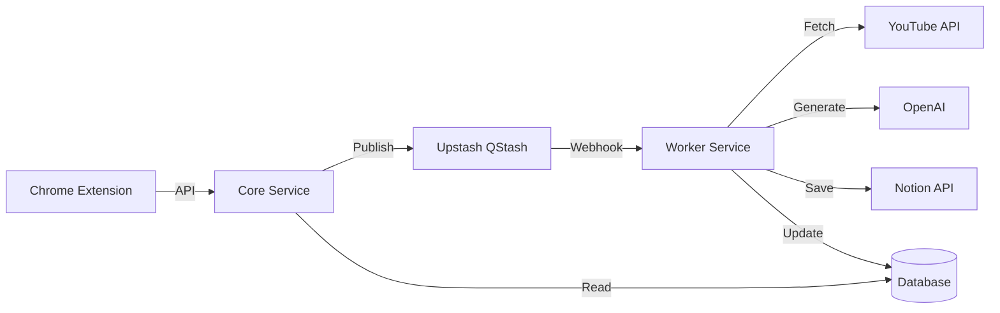

# TubeWiki プロジェクト状況レポート

## 概要

TubeWikiは、AIを使用してYouTube動画から学習ガイドを自動生成し、Notionに保存するシステムです。

### 主なコンポーネント

- **Core Service**: ノートの管理とジョブのキューイングを行うAPI。
- **Worker Service**: 動画コンテンツを処理するバックグラウンドワーカー。
- **Shared Library**: 共通のデータモデルとデータベースユーティリティ。
- **Chrome Extension**: ユーザーが生成をトリガーするためのフロントエンドインターフェース。

---

# アーキテクチャ概要

---

# 実装状況: Core Service

**ステータス: 実装済み**

- **APIルート**:
  - `POST /api/v1/notes`: ノートレコードを作成し、QStashにジョブを発行。
  - `GET /api/v1/notes/{id}`: ノートの詳細を取得。
  - `GET /api/v1/notes/by-url/`: 動画URLからノートを検索。
- **認証**: Supabase JWT統合。
- **インフラ**: 非同期処理のためのQStash統合。

---

# 実装状況: Worker Service

**ステータス: 実装済み**

- **Webhookハンドラ**: `POST /webhooks/process-job`
  - QStashの署名を検証。
  - ノートのステータスを使用して冪等性を処理。
- **サービス**:
  - **YouTube**: トランスクリプトを取得。
  - **AI**: 要約とMermaidダイアグラムを生成。
  - **Notion**: 生成されたコンテンツでNotionページを作成。
- **エラー処理**: エラー時にノートのステータスをFAILEDに更新。

---

# 実装状況: Shared Library

**ステータス: 実装済み**

- **モデル**:
  - `Note`: 動画URL、ステータス（PENDING, PROCESSING, COMPLETED, FAILED）、コンテンツを追跡。
  - `User`: ユーザーID管理。
- **スキーマ**:
  - `JobRequest`: ジョブペイロードの標準化されたフォーマット。
- **データベース**: PostgreSQL/SQLiteをサポートする非同期SQLAlchemy/SQLModelセットアップ。

---

# 実装状況: Chrome Extension

**ステータス: 実装済み**

- **技術スタック**: React, Vite, Tailwind CSS.
- **コンポーネント**:
  - **Popup**: ユーザーログインとステータス表示。
  - **Content Script (`Overlay.tsx`)**: YouTubeページに「Generate Note」ボタンを注入。
- **統合**: Core Service APIと通信。

---

# 次のステップ

1.  **テスト**:
    -   `tests/` ディレクトリ内の既存のテストを実行。
    -   エンドツーエンドのフロー（Extension -> Core -> Worker -> Notion）を検証。
2.  **デプロイ**:
    -   CoreとWorkerをクラウドプロバイダー（例: Railway, Vercel）にデプロイ。
    -   Chrome Extensionを公開。
3.  **改善**:
    -   エラー処理と再試行の改善。
    -   より良い要約のためのプロンプトエンジニアリングの強化。
