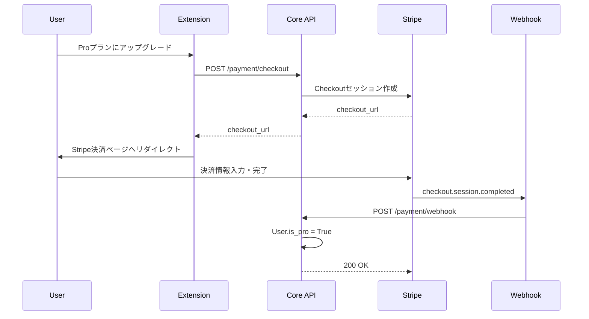

# Stripe実装ドキュメント

TubeWikiにおけるStripe決済統合の実装詳細

---

## 概要

TubeWikiでは、**Stripe Checkout**を使用してサブスクリプション決済を実装しています。

### 主な機能
- ✅ Stripe Checkoutセッションの作成
- ✅ Webhookによる決済完了通知の受信
- ✅ ユーザーのProステータス自動アップグレード
- ✅ セキュアな署名検証

---

## アーキテクチャ



---

## ファイル構成

### 1. Stripeサービス層
**ファイル**: [`core/services/stripe_service.py`](file:///Users/motoki/projects/TubeWiki/core/services/stripe_service.py)

主要メソッド:
- `create_checkout_session()` - Checkoutセッション作成
- `construct_event()` - Webhook署名検証

---

### Stripeサービス実装詳細

```python
class StripeService:
    def create_checkout_session(self, user_id: str, email: str, 
                                success_url: str, cancel_url: str):
        checkout_session = stripe.checkout.Session.create(
            payment_method_types=['card'],
            line_items=[{
                'price': config.STRIPE_PRICE_ID,
                'quantity': 1,
            }],
            mode='subscription',
            success_url=success_url,
            cancel_url=cancel_url,
            client_reference_id=user_id,  # ユーザー紐付け
            customer_email=email,
            metadata={"user_id": user_id}
        )
        return checkout_session.url
```

---

### 2. Payment APIエンドポイント
**ファイル**: [`core/api/payment.py`](file:///Users/motoki/projects/TubeWiki/core/api/payment.py)

#### エンドポイント一覧

| メソッド | パス | 説明 | 認証 |
|---------|------|------|------|
| POST | `/payment/checkout` | Checkoutセッション作成 | ✅ 必須 |
| POST | `/payment/webhook` | Stripe Webhook受信 | ❌ 不要 |

---

### Checkout APIの実装

```python
@router.post("/payment/checkout")
async def create_checkout_session(
    user_id: str = Depends(get_current_user),
    session: AsyncSession = Depends(get_session)
):
    user = await session.get(User, user_id)
    if not user:
        raise HTTPException(status_code=404, detail="User not found")
    
    url = stripe_service.create_checkout_session(
        user_id=user_id,
        email=user.email,
        success_url="https://example.com/success",
        cancel_url="https://example.com/cancel"
    )
    return {"checkout_url": url}
```

---

### Webhook APIの実装

```python
@router.post("/payment/webhook")
async def stripe_webhook(
    request: Request, 
    stripe_signature: str = Header(None),
    session: AsyncSession = Depends(get_session)
):
    payload = await request.body()
    event = stripe_service.construct_event(payload, stripe_signature)
    
    if event['type'] == 'checkout.session.completed':
        session_data = event['data']['object']
        user_id = session_data.get('client_reference_id')
        
        user = await session.get(User, user_id)
        if user:
            user.is_pro = True  # Proステータスに昇格
            session.add(user)
            await session.commit()
    
    return {"status": "success"}
```

---

### 3. ユーザーモデル
**ファイル**: [`shared/models/user.py`](file:///Users/motoki/projects/TubeWiki/shared/models/user.py)

```python
class User(SQLModel, table=True):
    __tablename__ = "users"
    
    id: str = Field(primary_key=True)  # Supabase Auth ID
    email: str = Field(index=True, unique=True)
    created_at: datetime = Field(default_factory=datetime.utcnow)
    is_pro: bool = Field(default=False)  # 👈 Pro会員フラグ
```

---

## 環境変数設定

**ファイル**: [`core/config.py`](file:///Users/motoki/projects/TubeWiki/core/config.py)

### 必須環境変数

| 変数名 | 説明 | 取得方法 |
|--------|------|----------|
| `STRIPE_SECRET_KEY` | Stripeシークレットキー | Stripe Dashboard > Developers > API keys |
| `STRIPE_PRICE_ID` | サブスクリプション価格ID | Stripe Dashboard > Products > Price ID |
| `STRIPE_WEBHOOK_SECRET` | Webhook署名検証用シークレット | Stripe Dashboard > Webhooks > Signing secret |

---

### 環境変数の設定例

```bash
# core/.env
STRIPE_SECRET_KEY=sk_test_xxxxxxxxxxxxx
STRIPE_PRICE_ID=price_xxxxxxxxxxxxx
STRIPE_WEBHOOK_SECRET=whsec_xxxxxxxxxxxxx
```

> [!WARNING]
> **本番環境では必ず `sk_live_` で始まるライブキーを使用してください。**

---

## 決済フロー

### 1️⃣ ユーザーがCheckoutを開始
- Chrome拡張機能から「Proにアップグレード」をクリック
- `/payment/checkout` APIを呼び出し

### 2️⃣ Stripe Checkoutページへリダイレクト
- StripeがホストするCheckoutページで決済情報を入力

### 3️⃣ 決済完了後のWebhook処理
- Stripeが `/payment/webhook` にイベントを送信
- `checkout.session.completed` イベントを検知
- `User.is_pro = True` に更新

---

## セキュリティ対策

### ✅ 実装済み

1. **Webhook署名検証**
   - `stripe.Webhook.construct_event()` で署名を検証
   - 不正なリクエストを拒否

2. **ユーザー認証**
   - Checkout API は `get_current_user` で認証必須
   - 他人のアカウントで決済不可

3. **user_id の上書き**
   - クライアントから送信された `user_id` を無視
   - JWTトークンから取得した `user_id` を使用

---

## 未実装・TODO

> [!CAUTION]
> 以下の項目は現在未実装です。

### ❌ 本番用のリダイレクトURL
現在はハードコードされた仮のURL:
```python
success_url = "https://example.com/success"
cancel_url = "https://example.com/cancel"
```

**対応策**: 環境変数または動的に生成する必要あり

---

### ❌ サブスクリプションキャンセル処理
- ユーザーがサブスクリプションをキャンセルした場合の処理が未実装
- `customer.subscription.deleted` イベントのハンドリングが必要

**実装例**:
```python
if event['type'] == 'customer.subscription.deleted':
    user.is_pro = False
    await session.commit()
```

---

### ❌ エラーハンドリングの強化
- Webhook処理中のエラーログは記録されるが、リトライ機構なし
- Stripe側で自動リトライされるが、アプリ側でも対応が望ましい

---

## テスト方法

### 1. Stripe CLIでローカルテスト

```bash
# Stripe CLIをインストール
brew install stripe/stripe-cli/stripe

# Webhookをローカルにフォワード
stripe listen --forward-to localhost:8000/payment/webhook

# テストイベントをトリガー
stripe trigger checkout.session.completed
```

---

### 2. テストカード番号

| カード番号 | 結果 |
|-----------|------|
| `4242 4242 4242 4242` | 成功 |
| `4000 0000 0000 0002` | カード拒否 |
| `4000 0025 0000 3155` | 3Dセキュア認証が必要 |

有効期限: 任意の未来の日付  
CVC: 任意の3桁  
郵便番号: 任意

---

## まとめ

### ✅ 実装済み機能
- Stripe Checkoutセッション作成
- Webhook受信と署名検証
- ユーザーのProステータス自動更新

### ⚠️ 今後の課題
- 本番用リダイレクトURLの設定
- サブスクリプションキャンセル処理
- エラーハンドリングの強化
- 決済履歴の保存

---

## 参考リンク

- [Stripe Checkout ドキュメント](https://stripe.com/docs/payments/checkout)
- [Stripe Webhooks ガイド](https://stripe.com/docs/webhooks)
- [Stripe API リファレンス](https://stripe.com/docs/api)
