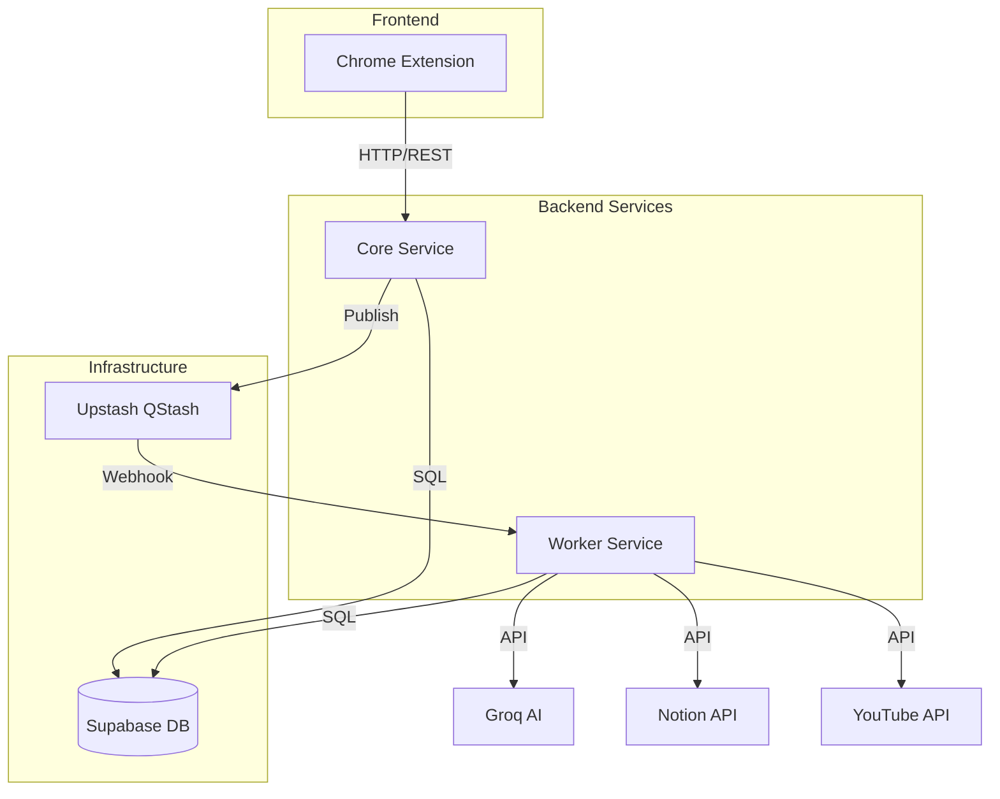
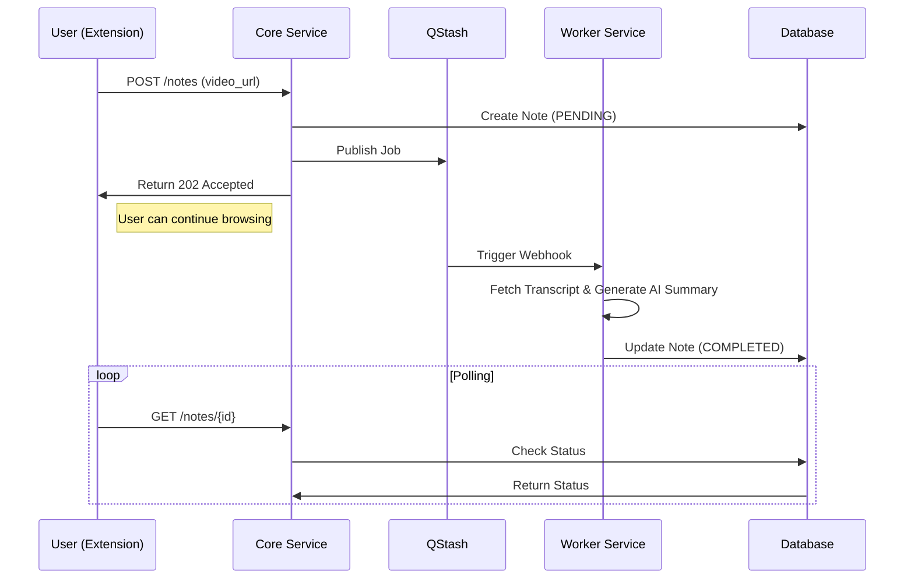

# TubeWiki System Architecture

**Current Architecture Overview**

Serverless Event-Driven Microservices

---

## 🏗️ Architecture Overview

TubeWiki adopts a **Serverless Event-Driven Architecture** to ensure scalability and cost efficiency.

### Key Characteristics
- **Microservices**: Separation of concerns between User API (Core) and Background Processing (Worker).
- **Event-Driven**: Asynchronous communication via Upstash QStash.
- **Serverless**: Deployed on Railway (Core/Worker) and Supabase (DB).

---

## 🧩 System Components



---

## 📦 Component Details (1/2)

### 1. Chrome Extension (Frontend)
- **Tech Stack**: React, TypeScript, Vite
- **Role**: User Interface, Capture YouTube URL, Display Notes.
- **Key Features**:
  - Supabase Auth Integration
  - Notion Auto-paste
  - Export to Markdown/Notion

### 2. Core Service (API Gateway)
- **Tech Stack**: Python, FastAPI
- **Role**: Handle user requests, Authentication, Job Dispatch.
- **Key Responsibilities**:
  - Validates user requests.
  - Creates initial `PENDING` note in DB.
  - Publishes job to QStash.

---

## 📦 Component Details (2/2)

### 3. Worker Service (Background Processor)
- **Tech Stack**: Python, FastAPI
- **Role**: Execute heavy AI tasks.
- **Key Responsibilities**:
  - Receives Webhook from QStash.
  - Fetches YouTube Transcript.
  - Generates Summary using Groq (Llama 3).
  - Creates Notion Page.
  - Updates DB with `COMPLETED` status.

### 4. Shared Library
- **Content**: Pydantic Models, SQLModel Schemas, Utilities.
- **Role**: Ensures consistency between Core and Worker.

---

## 🔄 Data Flow: Note Generation



---

## 🛠️ Infrastructure & External Services

### Database
- **Supabase (PostgreSQL)**
- **Connection**: Transaction Pooler (Port 6543) for serverless compatibility.
- **ORM**: SQLModel (SQLAlchemy + Pydantic).

### Event Bus
- **Upstash QStash**
- **Role**: Decouples Core and Worker. Handles retries and reliable delivery.

### AI Engine
- **Groq API**
- **Model**: Llama 3 (High speed inference).

---

## 📂 Directory Structure

```
TubeWiki/
├── extension/          # Chrome Extension (React/TS)
├── core/              # Core API Service (FastAPI)
├── worker/            # Worker Service (FastAPI)
├── shared/            # Shared Code (Models, Utils)
└── docs/              # Documentation
```

### Deployment
- **Core & Worker**: Railway
- **Database**: Supabase
- **Extension**: Chrome Web Store (Target)
